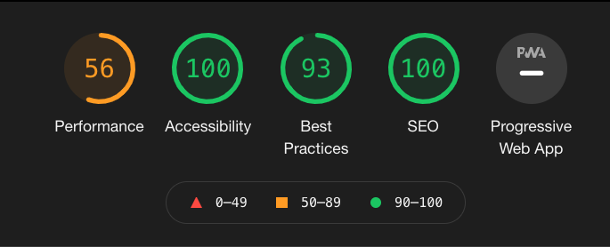

# Feeture Films
Visit the most trusted recommendation resource for quality entertainment, Feeture Films!

## Description
- Feeture Films provides a user friendly experience to research current and past films
- Click on a film to expand the movie’s details
- Return to the homepage with the home button, in the upper left corner 

## Accessibility
- The app's design is responsive with several breakpoints to accommodate various screen sizes.
- Lighthouse audit upon release:
 

## Setup
- Fork this project to your own Github account
- Clone the repository to your local machine
- `cd` into the project
- `npm i` to install dependencies
- `npm start` to open application’s page

## Technologies Used
- React
- Javascript
- React Testing Library/Jest
- Cypress
- Router
- HTML
- CSS

## Next Steps
- Add a feature to favorite movies
- Add the ability to store users’ ratings for movies

## Team & Individual Goals
- Solidify the use of React fundamentals and AJAX 
- Test React components by learning new testing paradigms
- Create a multi-page UX using Router   
- Devote time to quality project planning 

## Authors
- Tyson McNutt [@tysnj](https://github.com/tysnj) 
- Melanie Daoheuang [@daomeow](https://github.com/daomeow)
